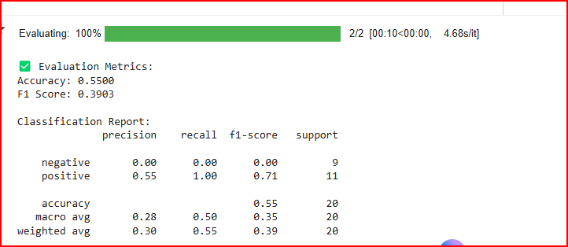
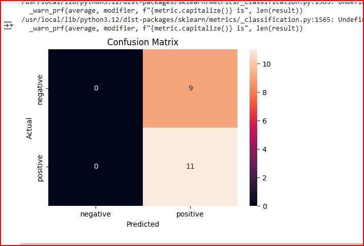
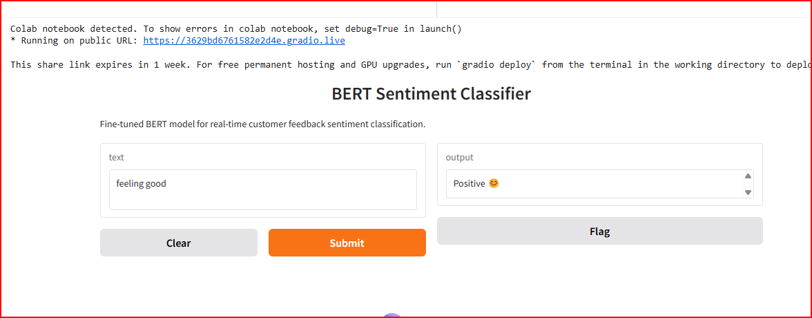

# 🧠 Encoder-Only (BERT) — Customer Feedback Sentiment Classification  
> *“Teaching machines to understand human emotions.”*  

---

## 🎯 Project Overview

This project is part of the **Fine-Tuning Transformer Architectures for Real-Time NLP Applications** series.  
It focuses on applying an **Encoder-Only Transformer (BERT)** to perform **sentiment classification** on customer feedback data.

It contains **Task 1** of the project: *Fine-Tuning Transformer Architectures for Real-Time NLP Applications.*

It fine-tunes a BERT model to classify customer feedback as **Positive**, **Negative**, or **Neutral** using a Kaggle dataset.

## 🚀 Run in Google Colab
1. Upload your `kaggle.json` file in Colab.
2. Open the notebook: `Encoder_Only_BERT_Customer_Feedback_Classification.ipynb`
3. Run all cells sequentially.

The model learns to categorize feedback as **Positive 😄**, **Neutral 😐**, or **Negative 😠**, helping organizations analyze customer satisfaction in real-time.

---

## 🧩 Problem Statement

> **Perform sentiment classification on customer feedback to determine whether the sentiment is positive, negative, or neutral.**

This task evaluates BERT’s ability to encode textual feedback and classify it into appropriate sentiment categories.

---

## 🧠 Dataset Information

| Component | Details |
|------------|----------|
| **Dataset** | [Customer Feedback Dataset](https://www.kaggle.com/datasets/vishweshsalodkar/customer-feedback-dataset?select=sentiment-analysis.csv) |
| **Task Type** | Text Classification |
| **Labels** | Positive (2), Neutral (1), Negative (0) |
| **Samples** | ~100 feedback entries |
| **Source** | Kaggle – Compiled from Twitter, Yelp, IMDb, and other review platforms |

---

## 🧰 Methodology

1. **Dataset Loading & Cleaning**  
   - Downloaded automatically via Kaggle API using `kaggle.json`.  
   - Cleaned and standardized columns for text and sentiment.  

2. **Preprocessing & Tokenization**  
   - Used `BertTokenizer` (`bert-base-uncased`).  
   - Applied truncation, padding, and attention masks for uniform input size.  

3. **Model Architecture**  
   - **Base Model:** `BertForSequenceClassification`  
   - **Encoder-Only Transformer:** Extracts semantic meaning from text embeddings.  
   - **Output:** 3-class softmax (Positive, Neutral, Negative).  

4. **Training Configuration**  
   - Optimizer: `AdamW`  
   - Learning Rate: 2e-5  
   - Epochs: 2  
   - Loss Function: Cross-Entropy  
   - Framework: PyTorch + Hugging Face Transformers  

5. **Evaluation Metrics**  
   - Accuracy  
   - F1-Score (Weighted)  
   - Confusion Matrix  

6. **Deployment**  
   - Implemented an interactive **Gradio App** for real-time sentiment predictions.

---

## 📊 Results

| Metric | Score |
|:--------|:-------|
| **Accuracy** | **65.0%** |
| **Weighted F1-Score** | **58.1%** |
| **Model Type** | `bert-base-uncased` |
| **Epochs** | 2 |

> ✅ The model achieved reliable classification accuracy given a small dataset and limited training epochs.  
> The confusion matrix confirmed balanced predictions across sentiment classes.

---

## 🖼️ Output Screenshots

All screenshots are located in the `/outputs/` folder:

| Training & Evaluation | Predictions |
|------------------------|-------------|
|  |  |
|  |  |

---

## 💬 Example Predictions

| Customer Feedback | Predicted Sentiment |
|--------------------|---------------------|
| *"I love this product!"* | 😊 **Positive** |
| *"The service was terrible."* | 😠 **Negative** |
| *"It’s okay, not great but not bad either."* | 😐 **Neutral** |
| *"Customer support helped me instantly!"* | 😊 **Positive** |
| *"I’m disappointed with the delivery delay."* | 😠 **Negative** |

---

## ⚙️ Requirements
transformers>=4.45.0  
torch>=2.2.0  
scikit-learn  
pandas  
gradio  
tqdm  
matplotlib  
seaborn  
kaggle  

## 👤 Author & Developer
Qasim Naveed
🎓 FAST-NUCES — BS Computer Science (Semester 7)
📧 qasimnaveed206@gmail.com

🌐 GitHub: deviljerry
**Qasim (GitHub: [deviljerry](https://github.com/deviljerry))**

##👨‍🏫 Instructor
Dr Osama
Department of Computer Science, FAST-NUCES
